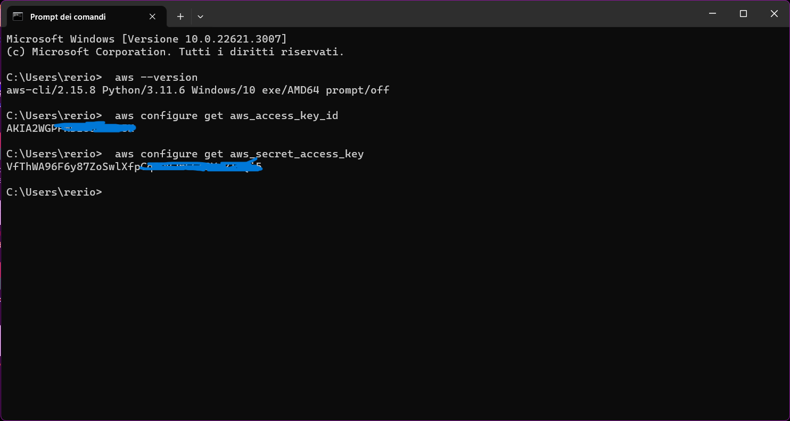

# AWS Ops Exercise - EC2 Autoscaling and SQS
(Roberto Russo solution) 

**Explanation of the exercise**


This exercise involves setting up an **AWS environment** where **EC2 instances scale based on SQS queue messages**.

-It includes creating an **SQS queue**

-Writing **Python scripts for a message producer (running on your desktop), and a consumer (running on EC2 instances)**.

-Additionally, it involves setting up **an EC2 Auto Scaling group** with the **consumer script** in its **launch template bootstrap process**  and testing the **scale-out/in mechanism based on the queue's message load.**

# Prerequisites:
- A clean AWS CLI environment where you have already set your Access Keys.

- IAM Role with the necessary SQS access policies for sending and receiving messages for EC2 instances.

- A standard Amazon SQS Queue.

- A Key Pair for EC2 instances.

- A Public Amazon S3 Bucket. Ensure that the bucket has the appropriate GetObject policy applied.

- Python scripts for Producer and Consumer: Producer.py should be on your desktop, and Consumer.py should be in a bucket to make it downloadable on your EC2 instances.

- An Autoscaling Group with Scaling Policies attached to Amazon CloudWatch Alarms.

- A Launch Template.

- Two CloudWatch Alarms for Scale Out and Scale In processes.

# Step 1: Check for your AWS CLI
Make sure you have a **Command Line Interface (CLI)** installed on your **desktop**; 

it is a mandatory requirement to launch the **producer script from the desktop** and gain access to the AWS environment.

- To verify this, open your **Command Prompt** and enter:

  ```
  aws --version
  aws configure get aws_access_key_id
  aws configure get aws_secret_access_key
  ```


  


