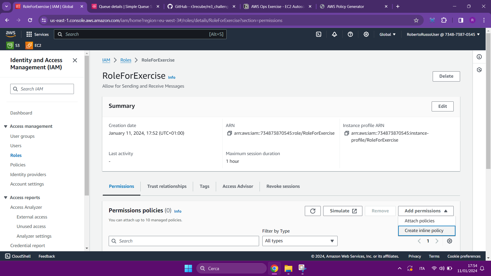
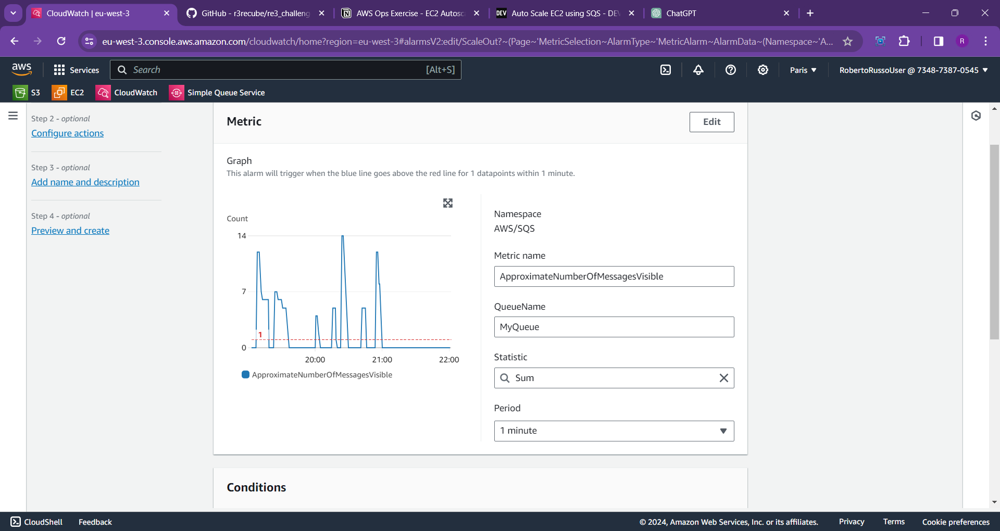
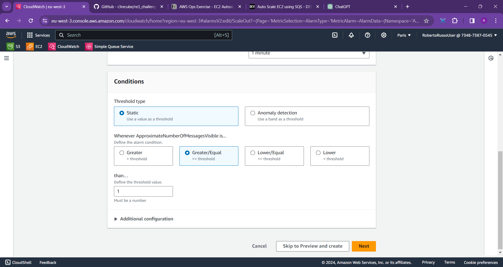
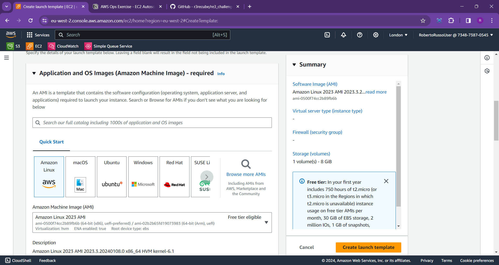
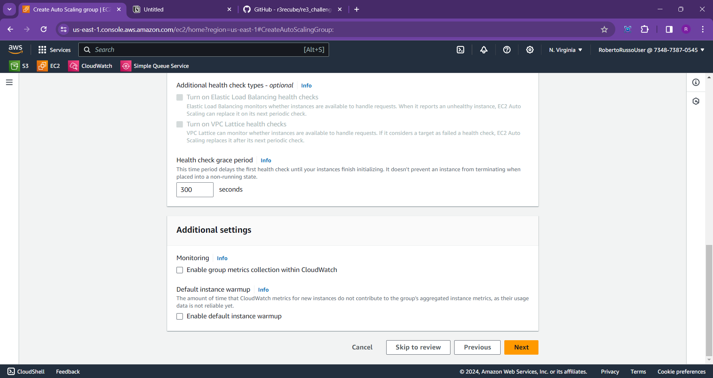

# AWS Ops Exercise - EC2 Autoscaling and SQS
(Roberto Russo solution) 

**Explanation of the exercise**


This exercise involves setting up an **AWS environment** where **EC2 instances scale based on SQS queue messages**.

-It includes creating an **SQS queue**

-Writing **Python scripts for a message producer (running on your desktop), and a consumer (running on EC2 instances)**.

-Additionally, it involves setting up **an EC2 Auto Scaling group** with the **consumer script** in its **launch template bootstrap process**  and testing the **scale-out/in mechanism based on the queue's message load.**

# Prerequisites:
- A clean AWS CLI environment where you have already set your Access Keys.

- IAM Role with the necessary SQS access policies for sending and receiving messages for EC2 instances.

- A standard Amazon SQS Queue.

- A Key Pair for EC2 instances.

- A Public Amazon S3 Bucket. Ensure that the bucket has the appropriate GetObject policy applied.

- Python scripts for Producer and Consumer: Producer.py should be on your desktop, and Consumer.py should be in a bucket to make it downloadable on your EC2 instances.

- An Autoscaling Group with Scaling Policies attached to Amazon CloudWatch Alarms.

- A Launch Template.

- Two CloudWatch Alarms for Scale Out and Scale In processes.

# Step 1: Check for your AWS CLI
Make sure you have a **Command Line Interface (CLI)** installed on your **desktop**; 

it is a mandatory requirement to launch the **producer script from the desktop** and gain access to the AWS environment.

- To verify this, open your **Command Prompt** and enter:

  ```
  aws --version
  aws configure get aws_access_key_id
  aws configure get aws_secret_access_key
  ```


If the prompt returns your access key credentials, it means you have already set them, and therefore, you have access to AWS resources.

Let's continue with the exercise.

# Step 2: Create a Standard SQS Queue

Now, let's create your Amazon SQS Queue.

- Open your AWS Console Home and use the search bar to find '**SQS**.' Click on the 'Simple Queue Service' result.
- In the SQS dashboard, navigate to **Create queue**.
- Enter the **Name** as 'MyQueue,' leave the other settings as defaults, and then click on **Create queue**. p.s. I setted MyQueue,but you can use every name you want for all the exercise.


Set your SQS Queue Name and then leave all settings as defaults.


Final result → You created your SQS Queue


# Step 3: Create a IAM Role for EC2 instances

1. Navigate to **IAM > Roles** and click on **Create role**.
2. Select **EC2** under use case and click **Next**.
3. Leave all options at their defaults and click **Next**.
4. Provide a Name for your Role and then click **Create Role**.
5. Once the Role is created, go to **Role > Permissions > Add Permissions > Create Inline Policy**.
6. In the Create Inline Policy, choose JSON, and replace the existing JSON policy with the following.
```json
{
  "Version": "2012-10-17",
  "Statement": [
    {
      "Sid": "Stmt1704991352140",
      "Action": [
        "sqs:DeleteMessage",
        "sqs:ReceiveMessage",
        "sqs:SendMessage"
      ],
      "Effect": "Allow",
      "Resource": "*"
    }
  ]
}
```
   
7. Click **Next** and then **Save Changes**.
8. Add a **Policy Name**.
9. You have successfully created your IAM Role and attached the SQS policies!


Select EC2 under Use Case


Create a Name for your Role and leave all settings as defaults.

Once the Role is created, go to **Role > Permissions > Add Permissions > Create Inline Policy**.



In the Create Inline Policy, choose JSON, and replace the existing JSON policy with the following and then save, you have done all here.

# Extra step: Simulate the policy
An extra step, but it's a **best practice** to do so, is to **simulate the policy**.

For this reason, let's go to the **Amazon Policy Simulator** and test the role. Filter by the SQS service, and in the actions, select **DeleteMessage, SendMessage, ReceiveMessage**.


Select your Role, service SQS and the actions said before.


As you can see, action are allowed so it's all OK.

# Step 4: Create a key pair

1. Navigate to **EC2 > Key Pairs** (under Network & Security).
2. Click on **Create key pair**.
3. Enter **Name** as `paris`. (In your setup, give it any name you prefer)
4. Click on **Create Key Pair**.
5. Download the Key and save it to your PC.


# Step 5: Create a Security Group

1. **We are going to create a Security Group for SSH.**
2. Navigate to **EC2 > Security Groups > Create a new security group**, and set the following values:
    - Name: `Exercise-SG`.
    - Add an Inbound rule to allow **SSH (TCP 22)** traffic from **My IP**.
3. Click **Create security group**.

*Note: Leave the Outbound rule with the default value.*


# **Step 6: Creating Python Scripts (parisProducer.py & parisConsumer.py)**

In this step of the exercise, I will provide you with the source code for creating the producer and consumer scripts.

The producer script is responsible for **sending messages to the SQS queue**, while the consumer script will **scan the queue and delete messages**, poll messages from the SQS queue, process them, and then wait for one minute before polling for messages again.

*Why this?* Because we need to set the message count to 0 for 0 instances.

### **parisProducer.py**

*(Pay attention to QueueName and Region; set them according to your configuration. In my case, I’ll provide mine, but if you want to replicate, I’ll also provide the source code in another folder with empty placeholders, and you can modify it when you want :D)*
```python
import boto3
import json


region = 'eu-west-3' # Replace 'REGION'  with your AWS region 
queue_name = 'MyQueue' # Replace 'QUEUE_NAME' with your  SQS queue name


sqs = boto3.client('sqs', region_name=region) # Create an SQS client

# JSON message content -> I'll use the exercise example
message_payload = {
    "vehicleId": "VH2001",
    "make": "Honda",
    "model": "Civic",
    "year": 2020,
    "color": "Blue",
    "mileage": 15000
}

# Send message to your SQS queue
queue_url = sqs.get_queue_url(QueueName=queue_name)['QueueUrl']
response = sqs.send_message(
    QueueUrl=queue_url,
    MessageBody=json.dumps(message_payload)
)
# Display the correct message sending with his MessageId connected
print(f"Message sent. MessageId: {response['MessageId']}")
```


### **parisConsumer.py**
```python
import boto3
import json
import time

region = 'eu-west-3' # Replace 'REGION'  with your AWS region 
queue_name = 'MyQueue' # Replace 'QUEUE_NAME' with your  SQS queue name


sqs = boto3.resource('sqs', region_name=region) # Create an SQS client
queue = sqs.get_queue_by_name(QueueName=queue_name)

# While loop for process, display, delete and wait messages

while True:
    messages = queue.receive_messages(MaxNumberOfMessages=1, WaitTimeSeconds=20)

    for message in messages:
        # Process the message content and display it
        content = json.loads(message.body)
        print(f"Processing message: {content}")

        # Delete the message from the queue after processing it
        message.delete()

    #  Adding a wait for one minute before polling for messages again
    time.sleep(60)
```


Save them on your PC, but now let’s upload to a new public bucket the parisConsumer.py one.


# Step 7: Create a public S3 Bucket

### 1: Navigate to S3 on AWS Console

Navigate to the AWS Console and find the **S3 service.**

### 2: Create a New S3 Bucket

1. Click on **Create bucket**.
2. Provide a unique and meaningful name for your bucket.
3. Choose the AWS region for your bucket.
4. Click **Next** until you reach the **Set permissions** page.

### 3: Set Permissions for a Public Bucket

1. On the **Set permissions** page, under **Manage public permissions**, uncheck the **Block all public access** option.
2. In the dialog box that appears, acknowledge the risks and click **Confirm**.
3. Click **Next** until you reach the **Review** page.

### 4: Review and Create the Bucket

1. Review your configuration.
2. Click **Create bucket**.

### 5: Upload Files to the Public Bucket

1. Once the bucket is created, navigate into the bucket.
2. Click on **Upload** to add files to your public S3 bucket.

### 6: Add GetObject Policy to the bucket
1. Go to your bucket and navigate in **Permissions**
2. Navigate to **Bucket Policy** and add this policy:
``` json
{
"Version": "2012-10-17",
"Id": "Policy1705013110994",
"Statement": [
{
"Sid": "Stmt1705013109716",
"Effect": "Allow",
"Principal": "",
"Action": "s3:GetObject",
"Resource": "arn:aws:s3:::parisbucket01/*"
}
]
}
```
Pay attention to "Resorce", add yout bucket ARN correctly and add before the closing " -> /*  
### 7: Accessing Public Files

1. Select a file in your bucket.
2. In the details pane, click on the file URL to access it publicly.

Congratulations! You have successfully created a public S3 bucket and uploaded files.

p.s. On a clipboard, save the  object URL you uploaded before, it will be useful when we're going to set the Launch Template.


# Step 8: Create CloudWatch Alarms

In this step, we will create two alarms:

1. **Scale Out Alarm**: This alarm triggers the Scale Out process, increasing our instances by +4.

2. **Scale In Alarm**: This alarm triggers the Scale In process, decreasing our instances by -4.

## Scale OUT alarm creation
1. **Go to CloudWatch** and click on **Alarms**.
2. When on **Alarms**, click **Create Alarm**. Select Metric.
3. On **Select Metric**, click **SQS** > **Queue Metrics** > select **ApproximateNumberOfMessagesVisible** for **MyQueue** > click on the button **Select Metric**.
4. Change **Statistic** from *Average* to **Sum**. Set **Period** to **1 Minute**.
   - On **Conditions**, select Threshold Type: **Static**.
   - Whenever ApproximateNumberOfMessagesVisible is **GreaterOrEqual (≥ threshold)** than **1**.
   - On **Datapoints**, change **Treat data as missing** to **Treat data as good**.
5. Click on **Next**, **Remove Notification** (leave as default).
6. Give an **Alarm Name** (e.g., **ScaleOut**), then click **Create alarm**.





## Scale IN alarm creation
1. **Go to CloudWatch** and click on **Alarms**.
2. When on **Alarms**, click **Create Alarm**. Select Metric.
3. On **Select Metric**, click **SQS** > **Queue Metrics** > select **ApproximateNumberOfMessagesVisible** for **MyQueue** > click on the button **Select Metric**.
4. Change **Statistic** from *Average* to **Sum**. Set **Period** to **1 Minute**.
   - On **Conditions**, select Threshold Type: **Static**.
   - Whenever ApproximateNumberOfMessagesVisible is **LowerOrEqual (≤  threshold)** than **1**.
   - On **Datapoints**, change **Treat data as missing** to **Treat data as good**.
5. Click on **Next**, **Remove Notification** (leave as default).
6. Give an **Alarm Name** (e.g., **ScaleIn**), then click **Create alarm**.


# Step 9: Create the Launch Template

1. On **EC2**, navigate to **Launch Templates** > **Create Launch Template**.

2. Provide a name for the **Launch Template Name**. Under **Application and OS**, select **Amazon Linux 2023 AMI**.

3. For **Instance Type**, choose **t2.micro**. For **Key Pair**, select the Key Pair created in the previous step (paris).

4. Under **Network Settings**, don't include a subnet in the launch template. Select the **Exercise-SG** created in the previous step for the Security Group. In **Advanced network settings**, add a network interface and leave it at the default.

5. Leave Storage and Resource tags as default.

6. For **Advanced details**, under **IAM instance profile**, select the **IAM Role** created in the previous step.

7. Under **User Data**, copy and paste the following Bash code. Ensure to edit the **wget link with the URL of your Python consumer script object** and update the **last prompt** where you invoke the **script with your filename.**

```bash
#!/bin/bash
aws configure set aws_access_key_id <YOUR_ACCESS_KEY_ID>
aws configure set aws_secret_access_key <YOUR_SECRET_ACCESS_KEY>
aws configure set default.region <YOUR_REGION>
aws configure set default.output json
sudo yum update -y
sudo yum install python3 -y
sudo yum install python3-pip -y
pip3 install boto3
wget <YOUR_BUCKET_OBJECT_URL_SELECT_THE_CONSUMERSCRIPT_py>
python3 <consumerfilename.py>

```





# Step 10: Create the Auto Scaling Group


1. Go to **EC2 > Auto Scaling Group > Create Auto Scaling Group**.

2. Provide a name for the Auto Scaling group (e.g., MyNewASG).

3. **Select the Launch Template** we created in the previous step and click **Next**.

4. Leave the **Default VPC** selected and choose one availability zone from your choices.

5. On **Configure Advanced Options**, leave all settings as **Default** and click **Next**.

6. On **Configure group size and scaling:**
   - Set Desired Capacity to **0**
   - Set Minimum Capacity to **0**
   - Set Maximum Capacity to **4**

7. On **Automatic Scaling**, select **No Scaling Policies**, and leave other settings to their default options. **We're going to set them after on dynamic scaling policies.**

8. Click on **Next** for **Notification**, and again click on **Next** for **Tags**.

9. **Review** the configuration.

10. Click **Create Configuration**.

You created the Auto Scaling Group.





